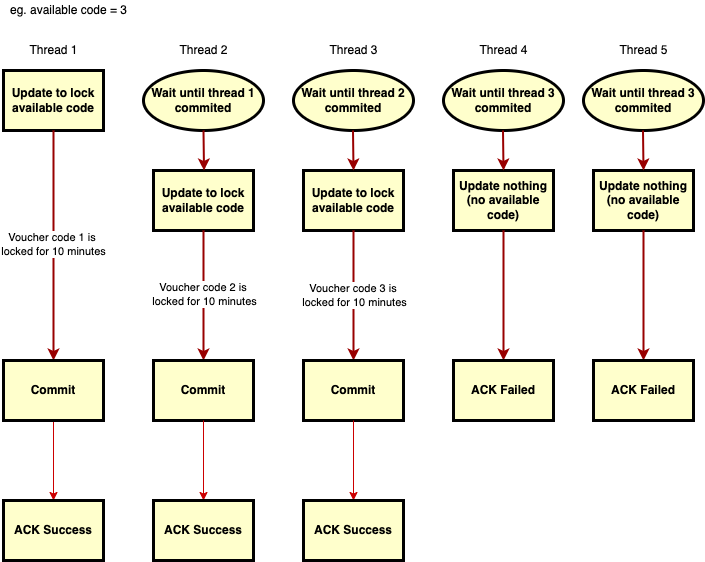

### Application description:

This application is a simple example of a laravel application that uses
the [Pessimistic Locking](https://laravel.com/docs/9.x/queries#pessimistic-locking).

We have 2 main APIs:

* [Check the Eligibility](API.md#check-the-eligibility) : `POST /api/voucher/check`
* [Claim the Voucher Code](API.md#claim-the-voucher-code) : `POST /api/voucher/claim`

### Capabilities:

* Promotion Campaigns rules is set up in the promotion table.(e.g campaign start/end date, minimum purchase amount, max redeem per customer,
  etc)
* Can handle multiple promotion campaigns.
* Can handle high volume of requests depending on the server load (recommended use a load balancer and auto-scale)
* Avoid the multiple allocation of the same voucher code using the Pessimistic concurrency control.

### How does it work?

This application uses the [Pessimistic Locking](https://laravel.com/docs/9.x/queries#pessimistic-locking).
It's a technique that allows you to lock a row in a database table for a short period of time. So, you can not get the same voucher code until the table row is unlocked.

In laravel we have 2 type of locks:
* `sharedLock()` : This is a lock that will block the current transaction from update until the row is unlocked. 
If the locked row already updated from other transaction it's will return  _SQLSTATE[40001]: Serialization failure: 1213 Deadlock found when trying to get lock._
* `lockForUpdate()` : This is a lock that will block the current transaction from select and update until the row is unlocked.

In this application we use the `lockForUpdate()` to lock the voucher code table. This is because we want to avoid the multiple allocation of the same voucher code.
So the selected voucher code record will be prevented from being modified or from being selected with another shared lock.


From above diagram we assume that available voucher codes are 3, and we have 5 concurrent requests(thread/customer).
* thread 1 will lock voucher code 1 (using `lockForUpdate()`)  then lock using `locked_for` column
* thread 2 will wait until thread 1 committed the query, then lock voucher code 2, 
* thread 3 will wait until thread 2 committed the query, then lock voucher code 3, 
* after thread 3 committed, thread 4 & 5 will return fail because no voucher code is available.

Theoretically, the above scenario can handle high concurrent visitor, but we need high performance server.

Another alternative is to use **message queue** to handle the concurrency. If we use message queue, we can handle high concurrent visitor, but we need to set up a message queue server.
I hope I have a chance to create another race condition solution using message queue and other methods.

### Technical Requirement:
This application use Laravel 9 framework, and it's default dependency
Here is the requirement: 
- PHP >= 8.0.10
- MySQL >= 8.0.0
- BCMath PHP Extension
- Ctype PHP Extension
- Fileinfo PHP extension
- JSON PHP Extension
- Mbstring PHP Extension
- OpenSSL PHP Extension
- PDO PHP Extension
- Tokenizer PHP Extension
- XML PHP Extension
- Mysqli PHP Extension

### How to run

```bash

# Clone the repository and go to the cloned directory

# install Composer dependencies/packages
$ composer install


$ cp .env.example .env
# then edit .env file to match your database configuration

$ php artisan key:generate

# Migrate and run seeding (do this every any update on the migration and the seeder)
$ php artisan migrate
$ php artisan db:seed 

#if you want to run in development use this:
$ php artisan serve

#if you want to run in production just set up on the web server or container(docker)

```

For testing purpose we have some sample customer in the database.

* Customer 1 (Eligible to claim voucher code): __eligible@customer.com__
* Customer 2 (Eligible to claim voucher code): __eligible2@customer.com__
* Customer 3 (Eligible to claim voucher code): __eligible3@customer.com__
* Customer 4 (Not eligible because not enough transaction): __poor@customer.com__
* Customer 5 (Not eligible because already redeemed code): __redeemed@customer.com__
* More 1000 customers is generated in the database using factory.

For the campaign we have 1 example promotion campaign with below rules:
* Campaign name is __Anniversary Promotion__
* Campaign code is __anniversary__. This code need to be added in body to each API request.
* Campaign start date is the current date when run the seeder. 
* Complete 3 purchase transactions within the last 30 days. `min_transaction_count` is __3__ and `last_transaction_days` is __30__.
* Total transactions equal or more than $100. `min_transaction_total` is __100__.
* Each customer is allowed to redeem 1 cash voucher only. `max_redemption_per_user_count` is __1__.
